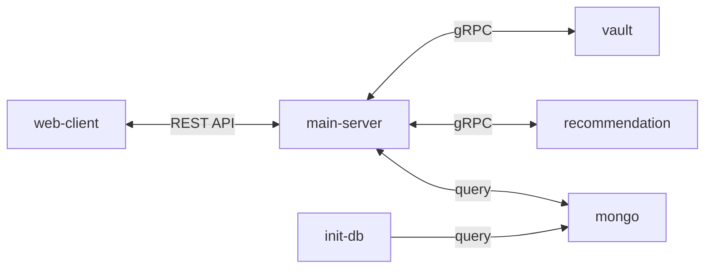

# gRPC showcase

## Project structure



* web-client - sends HTTP requests to the main-server
* main-server - hosts the REST API server and executes remote call procedures with gRPC clients
* vault - hosts a gRPC server for a Vault managing service
* recommendation - hosts a gRPC server for a recommendation engine
* mongo - stores Jira tasks in BSON format
* init-db - job for initialising the MongoDB with sample data

## How to run

```bash
docker compose up
```
